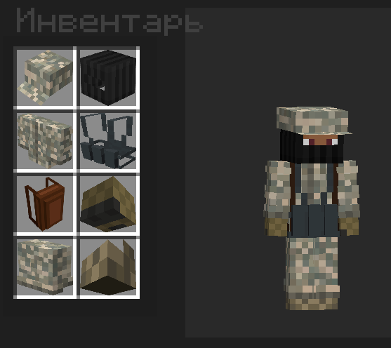

# inventory-POSTWORLD
Мод на майнкрафт 1 20 1 forge для динамических слотов одежды. Позволяет создавать одежду, при снаряжении которой добавляются новые слоты в инвентаре, а также имеются 8 слотов под одежду с своими рендерами это (Голова, Лицо, Рюкзак, Жилет, Грудь, Перчатки, Штаны, Ботинки) всё отображается на персонаже

